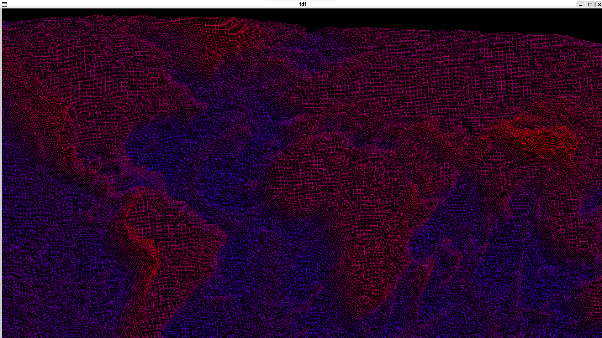

# FDF - Programa de Visualización de Mapas en 3D



FDF es una aplicación de visualización de mapas en 3D que te permite representar estructuras alámbricas en dos proyecciones diferentes: isométrica y militar. Esta herramienta es compatible tanto con sistemas operativos Linux como macOS. Utiliza la biblioteca gráfica MiniLibX para renderizar gráficos con líneas que incorporan el algoritmo de antialiasing de Xiaolin Wu para una representación más suave.

## Características

- **Proyecciones:** FDF ofrece dos modos de proyección: isométrica y militar. Puedes alternar entre estas proyecciones presionando la tecla 'p'.

- **Control de Cámara:** Toma el control de la cámara para navegar por el mapa:
  - Traducción: Utiliza las teclas WASD para mover la cámara en las direcciones arriba, izquierda, abajo y derecha, respectivamente.
  - Rotación: Utiliza las teclas Q y E para rotar la cámara en sentido antihorario y horario, respectivamente.
  - Zoom: Realiza un acercamiento y alejamiento utilizando las teclas Z y X, respectivamente.
  - Escala Vertical: Ajusta la escala vertical del mapa con las teclas V (aumentar) y B (disminuir).

## Requisitos del Sistema

- Sistema Operativo: Linux o macOS

## Instalación

1. Clona este repositorio en tu sistema local:
   ```sh
   git clone https://github.com/samuelcordero/fdf.git
2. Navega hasta el directorio del repositorio clonado:
   ```sh
   cd fdf
3. Compila el programa usando el siguiente comando:
   ```sh
   make

## Uso

1. Ejecuta el programa con el siguiente comando (puedes escoger un mapa de la carpeta maps):
   ```sh
   ./fdf maps/MGDS_WHOLE_WORLD_OCEAN1_L.fdf

## Créditos

- [MiniLibX](https://github.com/42Paris/minilibx) - Biblioteca gráfica utilizada para la representación visual.
- [Algoritmo de Línea de Xiaolin Wu](https://es.wikipedia.org/wiki/Algoritmo_de_Xiaolin_Wu) - Algoritmo de antialiasing utilizado para suavizar las líneas.
